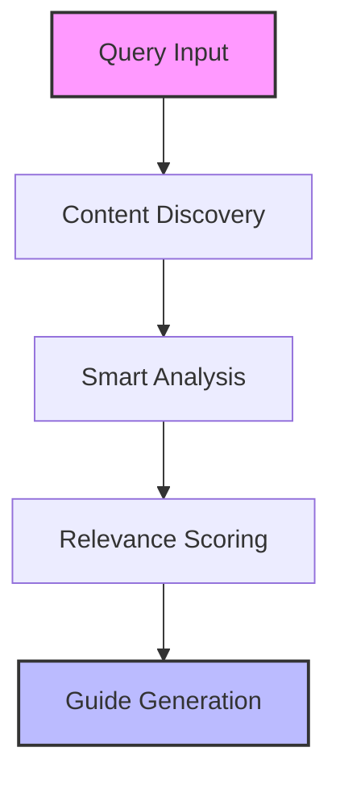
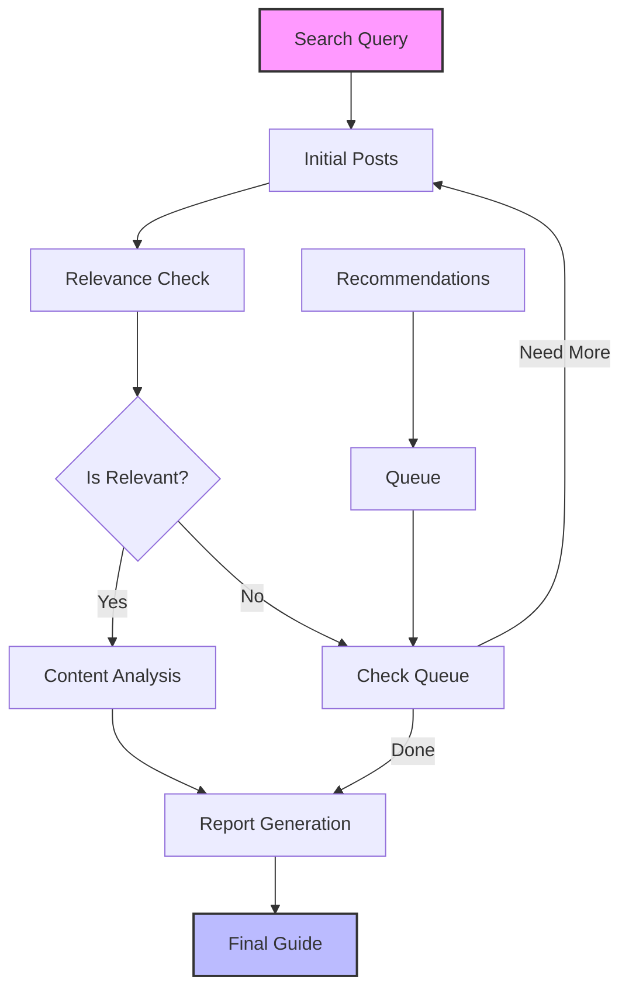

<div align="center">

# 🌎 Lemon8 Travel Guide Generator

[](https://www.python.org/downloads/)
[](https://pypi.org/project/crawl4ai/)

_Your AI-powered travel companion that turns authentic Lemon8 experiences into comprehensive guides_

</div>

---

A team of agents that analyzes real travel experiences from Lemon8 to create detailed, practical guides. By leveraging local insights and genuine recommendations, it helps you discover the best a destination has to offer.

## ✨ Key Features

### 🎯 Smart Content Analysis

- Advanced filtering and relevance scoring
- Cross-validation across multiple sources
- Focus on authentic, high-value content

### 🗺️ Comprehensive Coverage

| Category          | Details                           |
| ----------------- | --------------------------------- |
| 🏨 Accommodations | Hotels, hostels, Airbnb options   |
| 🍜 Food & Dining  | Local cuisine, restaurants, cafes |
| 🎪 Activities     | Tourist spots, hidden gems        |
| 🚇 Transport      | Public transit, getting around    |
| 🎭 Culture        | Local customs, etiquette          |
| 💰 Costs          | Budgeting, price ranges           |

### 📸 Rich Visual Content

- 16:9 optimized location photos
- Food and accommodation imagery
- Organized by category and relevance

### 💡 Local Expertise

- Authentic recommendations
- Insider tips and tricks
- Seasonal considerations
- Up-to-date information

### ⚠️ Travel Insights

- Important local warnings
- Peak/off-peak timing
- Cultural considerations
- Safety tips

## 🚀 Getting Started

### Prerequisites

- Python 3.11 or higher
- Poetry (recommended) or pip
- OpenAI API key

### Installation

```bash
# 1. Clone the repository
git clone https://github.com/your-username/lemon8-agent.git
cd lemon8-agent

# 2. Install dependencies
# Using poetry (recommended):
poetry install

# Or using pip:
pip install -r requirements.txt

# 3. Configure settings
cp .env.example .env
# Edit .env with your settings
```

## 📋 Architecture

### 📁 Project Structure

```
lemon8-agent/
├── src/                            # Source code
│   ├── agents/                     # AI agents
│   │   ├── lemon8_scraper.py      # Content discovery
│   │   ├── lemon8_analyzer.py     # Content analysis
│   │   ├── lemon8_relevance.py    # Relevance scoring
│   │   └── report_aggregator.py   # Guide generation
│   ├── config.py                  # Settings
│   ├── utils/                     # Utilities
│   │   └── logging_config.py      # Logging setup
│   └── main.py                    # CLI interface
├── logs/                          # Log files
├── output/                        # Generated guides
├── requirements.txt               # Dependencies
└── pyproject.toml                # Project metadata
```

### 🛠️ Dependencies

| Package          | Version     | Purpose             |
| ---------------- | ----------- | ------------------- |
| crawl4ai         | 0.5.0.post4 | Web crawling        |
| crewai           | 0.105.0     | Agent orchestration |
| langchain        | 0.3.20      | LLM integration     |
| langchain-openai | 0.3.7       | OpenAI support      |
| beautifulsoup4   | 4.12.3      | HTML parsing        |
| markdown         | 3.5.2       | Content formatting  |
| pillow           | 10.4.0      | Image processing    |

## 💡 Using the Guide Generator

### Quick Start

```bash
python src/main.py
```

### 🎯 Interactive Guide Creation

1. **Query Input** 📝

   ```
   🌟 Example Queries:
   • "things to do in Tokyo"
   • "best restaurants in Paris"
   • "hidden gems in Barcelona"
   • "local food in Bangkok"
   ```

2. **Content Focus** 🎯

   ```
   Choose Your Focus:
   1️⃣ Everything - Full city guide
   2️⃣ Food & Dining - Culinary exploration
   3️⃣ Activities - Things to do
   4️⃣ Accommodation - Places to stay
   5️⃣ Transport - Getting around
   6️⃣ Culture - Local insights
   ```

3. **Coverage Setting** 📊
   - Minimum: 5 sources
   - Recommended: 15+ sources
   - Maximum: No limit (quality-filtered)

### 🔄 Processing Steps



1. **Content Discovery** 🔍

   - Finds relevant Lemon8 posts
   - Explores recommendations
   - Gathers visual content

2. **Smart Analysis** 🧠

   - Relevance scoring (0-1.0)
   - Content quality check
   - Information validation

3. **Guide Creation** 📘
   - Combines insights
   - Organizes by category
   - Adds visual elements

### 📂 Output Structure

```
output/
└── [query]_[timestamp]/           # e.g., tokyo_guide_20250311/
    ├── metadata/                  # Analysis data
    │   ├── relevance_scores.md   # Content scoring
    │   └── screenshots/          # Visual content
    └── guides/                   # Final output
        ├── full_guide.md         # Complete guide
        └── category_guides/      # Focused guides
```

### 🎚️ Processing Limits & Behavior

The system intelligently manages content processing:

1. **Initial Search** 🔍

   - Fetches 2x requested posts
   - Example: Request 30 → Get 60 candidates

2. **Processing Queue** ⚙️

   - FIFO (First-In-First-Out) processing
   - Recommendations added to queue end
   - Maximum attempts = 3x requested posts
   - Example: Request 30 → Try up to 90 total

3. **Smart Termination** 🎯
   Stops when any condition is met:
   - Found enough relevant posts
   - Reached maximum attempts
   - Queue is empty

## 🛠️ Technical Details

### 🤖 Agent Workflow



### 🔄 Agent Coordination

1. **Scraper Agent** 🕷️

   - Content discovery and extraction
   - Screenshot capture (16:9 optimized)
   - Recommendation processing:
     - Breadth-first exploration
     - FIFO queue management
     - Duplicate prevention

2. **Relevance Agent** 🎯

   - Real-time content scoring
   - Travel relevance check
   - Queue management signals

3. **Analyzer Agent** 🧠

   - Content categorization
   - Information extraction
   - Context preservation

4. **Aggregator Agent** 📊
   - Content merging
   - Cross-validation
   - Guide structuring

### ⚙️ Technical Configuration

- **LLM Integration**

  - Model: OpenAI GPT
  - Temperature: 0.7
  - Structured prompting
  - Citation preservation

- **Content Processing**
  - YAML frontmatter
  - Normalized paths
  - Metadata tracking
  - Screenshot optimization

## 🤝 Contributing

We welcome contributions! Feel free to:

- Report bugs
- Suggest features
- Submit pull requests
- Share improvement ideas

## 📝 License

MIT License - feel free to use this code in your own projects!
