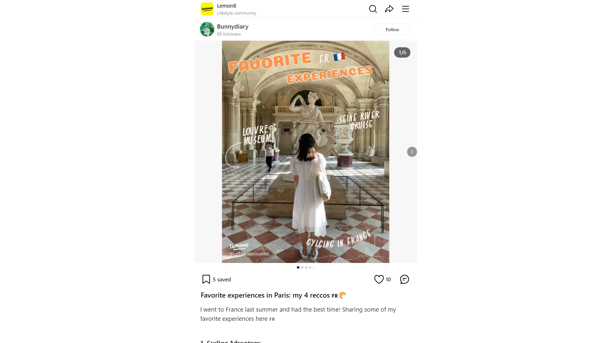

# Favorite experiences in Paris: my 4 reccos 🇫🇷🥐 | Gallery posted by Bunnydiary | Lemon8

Lemon8Lifestyle community

[Bunnydiary69 followers](https://www.lemon8-app.com/@callmeaaannnhhh?region=sg)
Follow
Follow
Follow

1/6
You may also like
[PARIS must-visits! 😍📌✨ EASY GUIDE[nat ⊂(･ω･*⊂)38](https://www.lemon8-app.com/fuzzyfrog?region=sg)](https://www.lemon8-app.com/fuzzyfrog/7364724154043662864?region=sg)
[COMPREHENSIVE GUIDE TO 4DAYS IN PARIS 🇫🇷🥐✨[nicolette 🌿84](https://www.lemon8-app.com/@lette.nico?region=sg)](https://www.lemon8-app.com/@lette.nico/7367624311080813072?region=sg)
[ALL HERE: 16 places + 4 shopping in PARIS 🫢‼️[burritobowl41](https://www.lemon8-app.com/@coolpigg?region=sg)](https://www.lemon8-app.com/@coolpigg/7448337050698416657?region=sg)
[MUST VISIT PLACES IN PARIS, FRANCE 🇫🇷[e 🤍6](https://www.lemon8-app.com/@e.lyseeee?region=sg)](https://www.lemon8-app.com/@e.lyseeee/7468563187021971986?region=sg)
[💳 🥷 Paris pickpocket survival guide 101[M🐹83](https://www.lemon8-app.com/@mikkkowen?region=sg)](https://www.lemon8-app.com/@mikkkowen/7228596874045997570?region=sg)
See more on the app
See more on the app
See more on the app
5 saved
10
# Favorite experiences in Paris: my 4 reccos 🇫🇷🥐
I went to France last summer and had the best time! Sharing some of my favorite experiences here 🇫🇷
𝟏. 𝐂𝐲𝐜𝐥𝐢𝐧𝐠 𝐀𝐝𝐯𝐞𝐧𝐭𝐮𝐫𝐞:
Exploring France on a bike with Lime app was a blast. Affordable and easy to use, it's the perfect way to soak up the scenery! There’re a lot of bike stations around, so it’s easy to find one. Cycling is definitely our number one way to get around Paris, aside from taking a cab to the airport
𝟐. 𝐒𝐞𝐢𝐧𝐞 𝐑𝐢𝐯𝐞𝐫 𝐂𝐫𝐮𝐢𝐬𝐞:
Booking a cruise via [@Klook Travel](https://www.lemon8-app.com/user/6961359531747607553/share?region=sg) was a highlight. Day or night, seeing Paris and especially Eiffel Tower from the water is breathtaking. Truly a memorable experience, especially when observing all the locals chilling by the riverbank and waving at you as the cruise passes by. Super cute!
𝟑. 𝐋𝐨𝐮𝐯𝐫𝐞 𝐌𝐮𝐬𝐞𝐮𝐦
Using a Nintendo audio guide from trip.com made touring the Louvre a breeze. We took time and enjoyed the art at our own pace! This was the cheapest option I could find for Louvre museum $48/pax - highly recommended! 
𝟒.𝐒𝐡𝐨𝐩𝐩𝐢𝐧𝐠 𝐅𝐢𝐧𝐝𝐬
France is a shopper's paradise. Stock up on French skincare brands like La Roche-Posay (my absolute favs)! I stocked up so many lip balm and Anthelios sunscreen - regretted not getting more though. I also bought my Celine belt which I loved so much here, from close to $1000 to only more than $600 in France cos it cheaper price + with 12% tax refund. Worth it 💕
[#AddToWishlist](https://www.lemon8-app.com/topic/7340916794481246210?region=sg) [#ThingsToDo](https://www.lemon8-app.com/topic/7111701935669395457?region=sg) [#traveltips](https://www.lemon8-app.com/topic/7195794094470250501?region=sg) [#francetravel](https://www.lemon8-app.com/topic/7216114915265249286?region=sg) [#paristravel](https://www.lemon8-app.com/topic/7209352672976666630?region=sg) [#travelwithlemon8](https://www.lemon8-app.com/topic/7145776166082789381?region=sg)
2024/3/23 Edited to
#