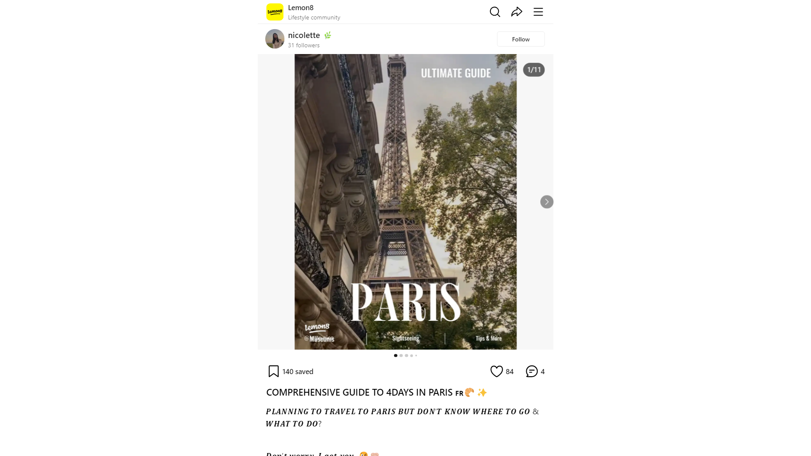

# COMPREHENSIVE GUIDE TO 4DAYS IN PARIS 🇫🇷🥐✨ | Gallery posted by nicolette 🌿 | Lemon8

Lemon8Lifestyle community

[nicolette 🌿31 followers](https://www.lemon8-app.com/@lette.nico?region=sg)
Follow
Follow
Follow

1/11
You may also like
[4 places to visit as day trips from Paris[whereiskare9](https://www.lemon8-app.com/whereiskare?region=sg)](https://www.lemon8-app.com/whereiskare/7246756221188030978?region=sg)
[read this before going to paris 🧳☁️[Kenme45](https://www.lemon8-app.com/kenme?region=sg)](https://www.lemon8-app.com/kenme/7235142683830862337?region=sg)
[10 DAYS EUROPE : PARIS | GOT PICKPOCKETED 😭🇫🇷[Faherah Begam73](https://www.lemon8-app.com/faherahbegam?region=sg)](https://www.lemon8-app.com/faherahbegam/7288540527170142722?region=sg)
[🚇Just one post to help you understand Paris Metro🚇[trip14](https://www.lemon8-app.com/trip.com?region=sg)](https://www.lemon8-app.com/trip.com/7264819021940310530?region=sg)
[‼️SAVE THIS IF YOU ARE GOING TO PARIS!🇫🇷🥐[🤍🍋71](https://www.lemon8-app.com/@anythingliterallygoes?region=sg)](https://www.lemon8-app.com/@anythingliterallygoes/7189512376977326594?region=sg)
See more on the app
See more on the app
See more on the app
140 saved
84
4
# COMPREHENSIVE GUIDE TO 4DAYS IN PARIS 🇫🇷🥐✨
𝑷𝑳𝑨𝑵𝑵𝑰𝑵𝑮 𝑻𝑶 𝑻𝑹𝑨𝑽𝑬𝑳 𝑻𝑶 𝑷𝑨𝑹𝑰𝑺 𝑩𝑼𝑻 𝑫𝑶𝑵’𝑻 𝑲𝑵𝑶𝑾 𝑾𝑯𝑬𝑹𝑬 𝑻𝑶 𝑮𝑶 & 𝑾𝑯𝑨𝑻 𝑻𝑶 𝑫𝑶? 
𝑫𝒐𝒏’𝒕 𝒘𝒐𝒓𝒓𝒚, 𝑰 𝒈𝒐𝒕 𝒚𝒐𝒖. 😉🤝🏼
my dream of visiting europe came true sometime during October last year when i embarked on a trip 2.5 week journey around some countries in europe (3 cities in england, 3 cities in scotland & 1 city in france)! as someone who loves exploring, eating good food and learning about a country’s history & culture, paris really blew my mind! it’s truly a vibrant hub immersed in deep artistic history and culture. 🇫🇷 🖤
though i only had 4 days to explore paris, i think i’ve covered most, if not all, of the popular tourist attractions & places you have to go!
‼️note: i did not go with a tour group. i planned this itinerary myself and travelled solely by Uber in Paris so i didn’t get to try out their public transport because Ubering around felt more convenient to me and was probably safer! 
——————————————————————————
𝐡𝐞𝐫𝐞 𝐢𝐬 𝐡𝐨𝐰 𝐢 𝐬𝐩𝐞𝐧𝐭 𝐦𝐲 4 𝐝𝐚𝐲𝐬 𝐢𝐧 𝐩𝐚𝐫𝐢𝐬! 🤩⬇️
𝐃𝐀𝐘 1️⃣: 
i arrived in paris in the afternoon, visited one museum and took it chill for the rest of the day lounging in my hotel 😴
1. 𝘼𝙧𝙧𝙞𝙫𝙖𝙡 𝙖𝙩 𝙋𝙖𝙧𝙞𝙨 ⭐️
📍Gare du Nord 
I took a train via Eurostar from London to Paris and the ticket costed around 140€ for a one-way trip (more expensive probably because i only booked it one week in advance) 
2. 𝙋𝙚𝙩𝙞𝙩 𝙋𝙖𝙡𝙖𝙞𝙨 ⭐️ (MUSEUM)
[Petit Palais](https://www.lemon8-app.com/poi/22535865217229304?region=sg)
💵: FREE
• suggested duration: 2-3hours
• art museum filled with paintings, sculptures & many other beautiful works of art 
• there’s a garden & more sculptures located in the outside area 
• there’s also a coffee shop inside for you to get snacks & drinks, sit around and admire the scenery outside! 
• super gorgeous museum it’s free so i highly recommend you to check it out, you can definitely take many pretty pictures there 😉
𝐃𝐀𝐘 2️⃣:
was a rather long day because i tried to pack as many spots into a day as possible and keep the other days more chill but you can always split the attractions up to visit different days :) 
1. 𝙋𝙤𝙣𝙩 𝙙𝙪 𝘾𝙖𝙧𝙧𝙤𝙪𝙨𝙚𝙡 ⭐️ (SIGHTSEEING)
[Pont du Carrousel](https://www.lemon8-app.com/poi/22535797119138351?region=sg)
• parisian bridge that spans the famous Seine River! 
• i decided to visit the [Panthéon](https://www.lemon8-app.com/poi/22535796482470238?region=sg) in the morning and i took a ~20mins walk from pantheon to the Lourve Museum. best decision because the view of the sea & the rest of paris from the bridge felt like i was in a painting 🥹🖼️. it was so so beautiful. taking a picture at the bridge is 100% a must!
• there are also little souvenir & vintage newspaper shops near the bridge too
2. 𝙏𝙝𝙚 𝙇𝙤𝙪𝙫𝙧𝙚 ⭐️ (MUSEUM) 
[Louvre Museum](https://www.lemon8-app.com/poi/22535865202508922?region=sg)
💵: 32SGD 
• suggested duration: 3-4hours (but you can definitely spend a whole day there)
• the most-visited art museum in the world!
• houses iconic works of art like the Mona Lisa by Leonardo Da Vinci, Venus de Milo ancient greek sculpture etc
• fun fact, if you spent 1 min viewing each piece of art, you’d have to spend 100 days in the Louvre to finish seeing all the art!
•it was truly a maze in the louvre! got lost many times and my legs were so tired from walking but it was so worth it! the pyramid outside of the museum is a great picture spot too~
3. 𝙋𝙖𝙡𝙖𝙘𝙚 𝙤𝙛 𝙑𝙚𝙧𝙨𝙖𝙞𝙡𝙡𝙚𝙨 ⭐️ (MUSEUM) 
[Palace of Versailles](https://www.lemon8-app.com/poi/22535865204803228?region=sg)
💵: 30SGD
• suggested duration: 2-3hours
• it’s located pretty far away from the central & most busy area of paris and it took us about an hour in an Uber to get there 
• a former royal residence and it was so mesmerising looking at the interiors & paintings on the walls
4. 𝙂𝙖𝙡𝙖𝙞𝙨 𝙇𝙖𝙛𝙖𝙮𝙚𝙩𝙩𝙚 ⭐️ (SHOPPING)
[Galeries Lafayette Haussmann](https://www.lemon8-app.com/poi/22535865224856189?region=sg)
• arguably the most beautiful store in the world, the mall is filled with shops that sell high quality & luxury fashion, accessories, beauty products and even household items 
• many people go to paris for the sake of shopping & buying designer/luxury products because it’s cheaper than buying it in singapore! my mom bought a channel bag and it costed around 1-2k cheaper than if she were to purchase it in singapore!👜🛍️ there’s even an option for tourists to ship the items back home with an added shipping fee
5. 𝙀𝙞𝙛𝙛𝙚𝙡 𝙏𝙤𝙬𝙚𝙧 ⭐️ (SIGHTSEEING)
[Eiffel Tower](https://www.lemon8-app.com/poi/22535865202411768?region=sg)
• ended my evening at the iconic eiffel tower!
• there was an option to get tickets that cost about 50SGD to go up the eiffel tower but i didn’t because i felt that it was necessary plus i was already tired from the day of walking 😅
• the tower sparkles for 5 mins at the start of every hour from 8PM to 1AM! 
• we took many photos and then waited for 8pm to see it sparkle and it truly did not disappoint! it was so magical ✨ 
𝐃𝐀𝐘 3️⃣: 
1. 𝘼𝙧𝙘 𝙙𝙚 𝙏𝙧𝙞𝙤𝙢𝙥𝙝𝙚 ⭐️ (SIGHTSEEING)
[Arc de Triomphe](https://www.lemon8-app.com/poi/22535865202811733?region=sg)
• one of the most famous monuments in paris that honours those who fought and died for france during the french revolution and the napoleonic wars!
• located in the middle of a busy road so please be careful when taking pictures 🥲 i witnessed someone almost getting run down by a car… 
2. 𝙈𝙪𝙨é𝙚 𝙙’𝙊𝙧𝙨𝙖𝙮 ⭐️ (MUSEUM) 
[Musée d'Orsay](https://www.lemon8-app.com/poi/22535865206192079?region=sg)
💵: 23SGD 
• suggested duration: 2-3hrs
• houses the world’s largest collection of impressionist and post-impressionist masterpieces in the world by painters including Berthe Morisot, Claude Monet, Édouard Manet, Degas, Van Gogh, and more
• i queued for about 45mins to get into the Van Gogh exhibitions and it was definitely worth it! though it can’t be compared to the physically emersive Van Gogh experience in Singapore, i found that the van gogh exhibition in Musée d’Oray was actually rather interesting as it showed more of Van Gogh’s works (with explanations) that i’ve never seen before! It also houses the Starry Night by Van Gogh!
𝐃𝐀𝐘 4️⃣: 
1. 𝙈𝙤𝙣𝙩𝙢𝙖𝙧𝙩𝙧𝙚 ⭐️ (SHOPPING STREET) 
• famous for its artistic heritage, this place has a distinctive village atmosphere with the white Sacré Coeur church crowning its highest point of the upward slopping hill 
• many food places, photo spots, shops & souvenirs!
2. 𝙎𝙖𝙘𝙧é 𝘾𝙤𝙚𝙪𝙧 ⭐️ (CHURCH/MUSEUM)
💵: FREE
[The Basilica of Sacré-Cœur de Montmartre](https://www.lemon8-app.com/poi/22535865211069638?region=sg)
• suggested duration: 1hr
• one of the most visited religious monuments in paris!
• it is located on the top of Montmatre and you can get a great panoramic view of paris from there, perfect to see the sunrise or sunset!
• i actually didn’t manage to get in that day because there was a bomb threat 😨 but the view still made the journey there worth it and there was a lovely garden nearby~
3. 𝙎𝙚𝙞𝙣𝙚 𝙍𝙞𝙫𝙚𝙧 𝘾𝙧𝙪𝙞𝙨𝙚 ⭐️ (SIGHTSEEING) 
💵: 37SGD
• duration: 2hours 
• i booked this river cruise from Tripadvisor and it’s one of the best investments of the trip! it was such a relaxing journey and a great way to photograph a lot of the iconic sites of paris without all the footwork. 
• it starts at canal saint-martin which is a more neighbourhood & less touristy area in Paris where you can find more affordable parisian food 😋
• there are snacks & drinks that you can buy on the ship 
• there is an upper & outside deck for you to sit at to admire the scenery whilst a tour guide speaks into the mic (in both french & english) explaining to you some history of paris! 
——————————————————————————
📝 𝗧𝗜𝗣𝗦: 
i travelled with my mom so here are some tips on how we stayed safe as just 2 ladies in the infamously dangerous paris!
1. 𝘼𝙫𝙤𝙞𝙙 𝙋𝙞𝙘𝙠𝙥𝙤𝙘𝙠𝙚𝙩𝙨
• always be aware of your surroundings - in both crowded and ulu areas
• i personally carried my bag as close to my body as i could to prevent it from being easily snatched. 
• try not to carry luxury or really expensive bags out and make sure your bags have zips so that your valuables won’t fall out easily. 
• walk closer to the insides of the pavement and stay away from the road as it’s not uncommon for motorcyclists to just snatch your bag away while on their vehicles!
2. 𝙁𝙧𝙚𝙚 𝙬𝙖𝙩𝙚𝙧 𝙞𝙣 𝙧𝙚𝙨𝙩𝙖𝙪𝙧𝙖𝙣𝙩𝙨
i went into a restaurant on the first day, asked for water and was left with a 18 SGD bill for evian water 🤦🏻‍♀️… here’s how to avoid making the same mistakes as me:
•you can get free water (tap water) by asking the waiter for a ‘un carafe’ instead of paying for water 
•note: if you want to order a coffee, latte in particular, do not order a coffee cause it usually means espresso. if you wanna order a latte is known as ‘cafe au lait’
3.𝘽𝙚𝙞𝙣𝙜 𝙧𝙚𝙨𝙥𝙚𝙘𝙩𝙛𝙪𝙡
• parisian people are stereotyped to be bitchy and rude but they are actually really nice to tourists! that’s if you are also nice to them. 
• when paying at the cashier or ordering food at a restaurant, it’s part of their culture to greet people there with ‘bonjour’ during the day and ‘bonsoir’ after sunset. if not, a ‘hello’ works too!
4. 𝙒𝙝𝙚𝙣 𝙖𝙥𝙥𝙧𝙤𝙖𝙘𝙝𝙚𝙙, 𝙖𝙡𝙬𝙖𝙮𝙨 𝙠𝙞𝙣𝙙𝙡𝙮 𝙧𝙚𝙟𝙚𝙘𝙩 𝙖𝙣𝙙 𝙢𝙤𝙫𝙚 𝙤𝙣
• often, there would be people approaching tourists to sell their items. when they do, just kindly reject & move on to avoid being scammed! usually if you engage in a conversation with them for too long, more people would start swarming towards you and pressuring you into buying things 😅
——————————————————————————
𝐭𝐨 𝐬𝐮𝐦 𝐮𝐩: though i only managed to carve out 4 days to spend in paris, i felt that it was more than enough for me and i visited most of the iconic places i’ve always wanted to go! no regrets, it was truly 𝐚 𝐭𝐫𝐢𝐩 𝐨𝐟 𝐚 𝐥𝐢𝐟𝐞𝐭𝐢𝐦𝐞 and im so beyond grateful to be able to experience this 🥹🖤🇫🇷✨
i hope that this post was helpful for those that are planning to travel there!~ i also have a much more detailed google document of my paris itinerary which includes the cost breakdown, more information about each location, how to get there as well as other places in paris i researched about & wanted to go but didn’t have time to! do drop me a comment or DM if you guys want me to share the link to the google docs! ☺️🫶🏼
let me know if i should share more about the other countries i’ve visited on this trip (england & scotland) 😲
[#ThingsToDo](https://www.lemon8-app.com/topic/7111701935669395457?region=sg) [#paris](https://www.lemon8-app.com/topic/7199953620581695493?region=sg) [#lemon8travel](https://www.lemon8-app.com/topic/7198471913272885253?region=sg) [#itinerary](https://www.lemon8-app.com/topic/7146196887640489989?region=sg) [#trip](https://www.lemon8-app.com/topic/6908695276039553030?region=sg) [#MyFreeTime](https://www.lemon8-app.com/topic/7352879109136990224?region=sg) [#Lemon8Tips](https://www.lemon8-app.com/topic/7216767943802699782?region=sg) [#europetravel](https://www.lemon8-app.com/topic/7215844111260794885?region=sg) [#Lemon8SG](https://www.lemon8-app.com/topic/7072348837645451266?region=sg) [#lemon8recommendations](https://www.lemon8-app.com/topic/7199523191537582085?region=sg)
2024/5/11 Edited to
## 4 comments

[Lady Bright Me](https://www.lemon8-app.com/lemon1356829827?region=sg)
Hi can i ask how u book the uber ? Isit loke same grab in spre ?
2024/9/15
Reply
See more(1)

[christine](https://www.lemon8-app.com/@mentaikool?region=sg)
is it safe to drink tap water in paris? and where did u book your seine cruise tickets!! 😆
2024/7/27
Reply
See more(1)
#