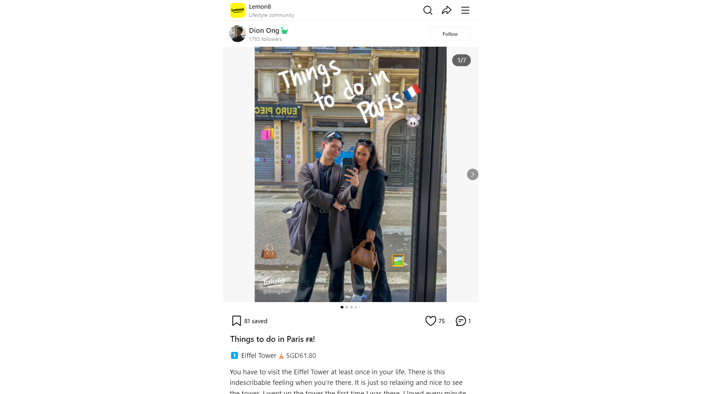

# Things to do in Paris 🇫🇷! by Dion Ong🦕

# Overview
This post offers a vibrant guide to experiencing the magic of Paris, highlighting must-visit attractions and personal anecdotes that bring the city to life. From iconic landmarks like the Eiffel Tower to the enchanting Disneyland Paris, the author shares insights that cater to both first-time visitors and seasoned travelers.

_Source: https://www.lemon8-app.com/@diongdion/7225905735505379841?region=sg_

### Engagement Analysis 📊
- **Community Response:** 75 Likes • 81 Saves • 1 Comment
- **Creator Impact:** [X] Followers • The creator shares personal travel experiences, enhancing their credibility in providing recommendations for Paris.
- **Content Quality:** High - The post is rich in detail, personal insights, and practical tips.

### Featured Locations/Activities 🗺
- **Eiffel Tower:** A must-see for its breathtaking views and iconic status.
- **Luxury Shopping:** Explore renowned Parisian brands and enjoy tax refunds.
- **Disneyland Paris:** A magical experience, especially during winter.
- **Louvre Museum:** Home to the Mona Lisa and a treasure trove of art.
- **Versailles Palace:** A historical gem with expansive gardens and rich history.
- **Arc de Triomphe & Champs-Élysées:** Essential Parisian landmarks worth exploring.

---

## Eiffel Tower

**Essential Info:**
- 📍 Location: Champ de Mars, 5 Avenue Anatole France, 75007 Paris, France
- ⏰ Hours: Open daily from 9:30 AM to 11:45 PM; best to visit in the morning to avoid crowds.
- 💰 Price Range: Tickets range from €16.60 to €25.50 depending on the level; consider the value of the views from the top.
- ⌛ Duration: Plan for at least 2-3 hours to fully enjoy the experience.
- 🎯 Best For: First-time visitors, couples, and photography enthusiasts.

### What Makes It Special ✨
The Eiffel Tower is not just a symbol of Paris but an architectural marvel that offers stunning panoramic views of the city from its third level. The experience of ascending the tower is both exhilarating and serene, making it a highlight of any trip to Paris.

### Visitor Experience 🎟
- **Atmosphere:** The ambiance is vibrant, filled with tourists and locals alike, especially during sunset.
- **Service:** Staff are generally helpful, and audio guides are available for a more informative visit.
- **Facilities:** Elevators, restrooms, and gift shops are available on-site.
- **Unique Features:** The light show at night is a breathtaking spectacle not to be missed.

### Pro Tips 💡
- 🎯 Book tickets online in advance to skip long lines.
- 🎯 Visit during off-peak hours for a more relaxed experience.
- 🎯 Don’t forget to take a moment to enjoy the gardens below.
- 🎯 Bring a camera for unforgettable photo opportunities.

### Visual Highlights 📸

*The intricate ironwork of the Eiffel Tower showcases its architectural beauty, especially when illuminated at night.*

---

## Luxury Shopping

**Essential Info:**
- 📍 Location: Avenue des Champs-Élysées, 75008 Paris, France
- ⏰ Hours: Varies by store; most open from 10 AM to 7 PM.
- 💰 Price Range: High-end luxury items; expect to spend significantly, but tax refunds can save you up to $1,000.
- ⌛ Duration: Allocate at least half a day for a leisurely shopping experience.
- 🎯 Best For: Fashion enthusiasts and luxury shoppers.

### What Makes It Special ✨
Paris is synonymous with luxury fashion, featuring flagship stores of world-renowned brands like Louis Vuitton, Dior, and Celine. The shopping experience is enhanced by the city's chic atmosphere and the opportunity to find exclusive items.

### Visitor Experience 🎟
- **Atmosphere:** The streets are bustling with fashionistas and tourists, creating a lively shopping environment.
- **Service:** High-quality customer service is standard in luxury boutiques.
- **Facilities:** Many stores offer personal shopping services and refreshments.
- **Unique Features:** Seasonal sales and exclusive collections make shopping in Paris a unique experience.

### Pro Tips 💡
- 🎯 Look for tax refund options to save on your purchases.
- 🎯 Visit during weekdays to avoid the weekend crowds.
- 🎯 Don’t hesitate to ask for personal shopping assistance.
- 🎯 Explore smaller boutiques for unique finds.

### Visual Highlights 📸

*The elegant storefronts of Parisian luxury brands reflect the city's fashion-forward culture.*

---

## Disneyland Paris

**Essential Info:**
- 📍 Location: Boulevard de Parc, 77700 Marne-la-Vallée, France
- ⏰ Hours: Typically open from 10 AM to 11 PM; check the schedule for seasonal variations.
- 💰 Price Range: Tickets range from €56 to €100 depending on the season and age group.
- ⌛ Duration: A full day is recommended to experience both parks.
- 🎯 Best For: Families, Disney fans, and thrill-seekers.

### What Makes It Special ✨
Disneyland Paris offers a magical escape with its enchanting rides, character meet-and-greets, and stunning seasonal decorations. The park's unique charm is amplified during winter, making it a picturesque destination.

### Visitor Experience 🎟
- **Atmosphere:** The park is filled with excitement and joy, especially during parades and shows.
- **Service:** Staff are friendly and helpful, enhancing the overall experience.
- **Facilities:** Ample dining options, restrooms, and accessibility services are available.
- **Unique Features:** The Walt Disney Studios park adds an extra layer of fun with behind-the-scenes experiences.

### Pro Tips 💡
- 🎯 Arrive early to maximize your time and enjoy popular rides with shorter wait times.
- 🎯 Consider purchasing a park hopper ticket for access to both parks.
- 🎯 Check the schedule for special events and parades.
- 🎯 Dress in layers for comfort, especially in winter.

### Visual Highlights 📸

*The enchanting castle at Disneyland Paris is a must-see, especially during the evening light shows.*

---

## Louvre Museum

**Essential Info:**
- 📍 Location: Rue de Rivoli, 75001 Paris, France
- ⏰ Hours: Open daily from 9 AM to 6 PM; closed on Tuesdays.
- 💰 Price Range: Entry tickets are €17; consider the Paris Museum Pass for multiple visits.
- ⌛ Duration: Plan for at least 3-4 hours to explore the highlights.
- 🎯 Best For: Art lovers, history enthusiasts, and culture seekers.

### What Makes It Special ✨
Home to the Mona Lisa and countless other masterpieces, the Louvre is a treasure trove of art and history. Its vast collection and stunning architecture make it a cultural landmark that should not be missed.

### Visitor Experience 🎟
- **Atmosphere:** The museum can be crowded, especially around popular exhibits, but the ambiance is one of awe and inspiration.
- **Service:** Staff are knowledgeable and can assist with directions and information.
- **Facilities:** Cafés, restrooms, and gift shops are available throughout the museum.
- **Unique Features:** The glass pyramid entrance is iconic and offers a striking contrast to the historic building.

### Pro Tips 💡
- 🎯 Purchase tickets online to skip the line.
- 🎯 Use the museum map to prioritize must-see artworks.
- 🎯 Consider joining a guided tour for deeper insights.
- 🎯 Visit during late hours on Wednesdays and Fridays for a quieter experience.

### Visual Highlights 📸

*The grandeur of the Louvre's architecture is as captivating as the art within its walls.* 

---

## Versailles Palace

**Essential Info:**
- 📍 Location: Place d'Armes, 78000 Versailles, France
- ⏰ Hours: Open from 9 AM to 6:30 PM; closed on Mondays.
- 💰 Price Range: Entry tickets are €20; audio guides are available for an additional fee.
- ⌛ Duration: A full day is recommended to explore the palace and gardens.
- 🎯 Best For: History buffs, architecture lovers, and garden enthusiasts.

### What Makes It Special ✨
The Palace of Versailles is a symbol of royal opulence and French history. Its stunning gardens and rich historical significance make it a captivating destination for visitors.

### Visitor Experience 🎟
- **Atmosphere:** The palace is grand and awe-inspiring, with visitors often feeling the weight of history.
- **Service:** Audio guides enhance the experience, providing context to the lavish surroundings.
- **Facilities:** Cafés and rest areas are available throughout the grounds.
- **Unique Features:** The expansive gardens are perfect for leisurely strolls and photo opportunities.

### Pro Tips 💡
- 🎯 Arrive early to avoid crowds, especially in peak tourist season.
- 🎯 Consider renting a bike to explore the vast gardens.
- 🎯 Don’t miss the fountains, which have scheduled shows.
- 🎯 Bring a picnic to enjoy in the gardens.

### Visual Highlights 📸

*The grandeur of the Hall of Mirrors is a highlight of the palace, showcasing its historical significance and architectural beauty.* 

--- 

This structured guide encapsulates the essence of Paris through the author's personal experiences and recommendations, making it a valuable resource for anyone planning to visit the city.

---
Source: https://www.lemon8-app.com/@diongdion/7225905735505379841?region=sg
Analyzed at: 2025-03-15 15:14:13
Content Length: 1898 characters
Content Preview: # Things to do in Paris 🇫🇷! | Gallery posted by Dion Ong🦕 | Lemon8
Lemon8Lifestyle community

81 saved
75
1
# Things to do in Paris 🇫🇷!
You have to visit the Eiffel Tower at least once in your li...
